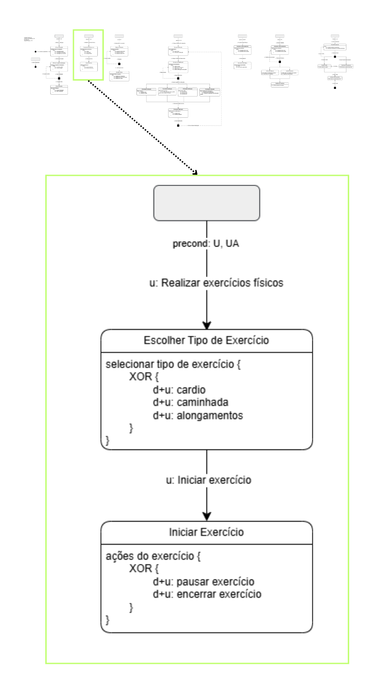
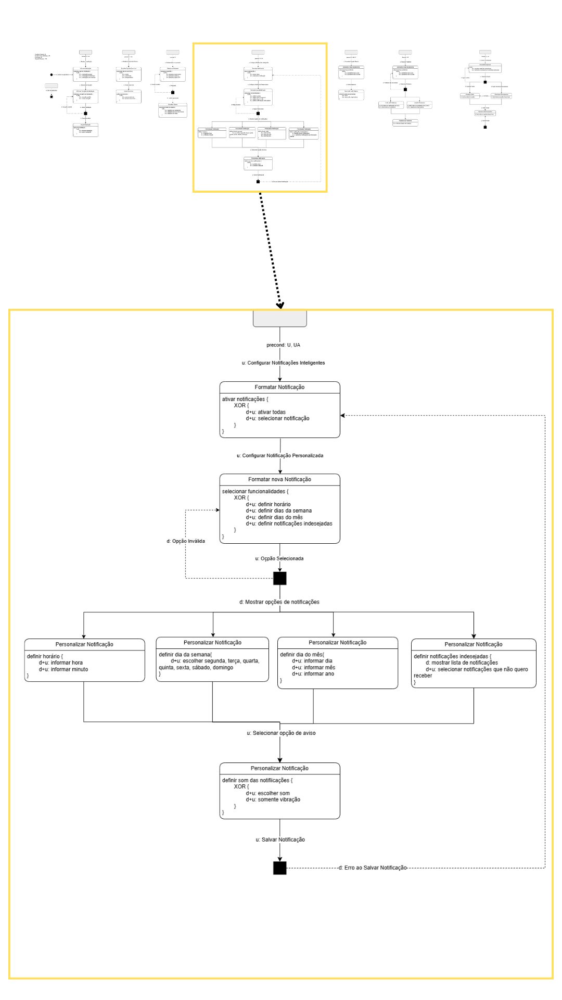
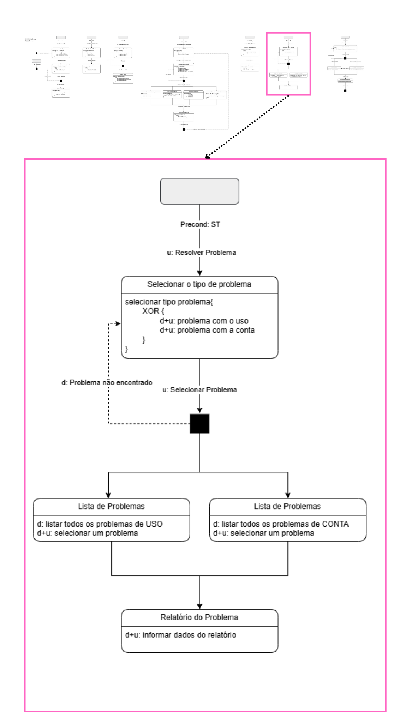

O MOLIC (Modelagem Lógica de Interação de Cenários) é uma abordagem para modelar interações entre usuários e sistemas, focando nos fluxos lógicos e comunicativos de maneira visual e intuitiva. Ele utiliza diagramas para representar cenários de interação, facilitando o design centrado no usuário e a comunicação entre equipes.

---

---

---

---

---

---

---