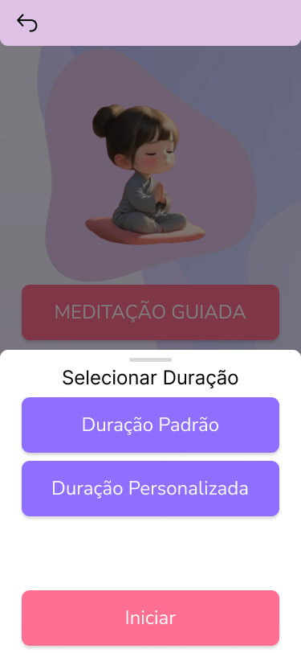

# SHOOTE 

## Meditação Guiada

<video width="640" height="360" controls>
  <source src="videos/meditação_giuada.mp4" type="video/mp4">
  Seu navegador não suporta o elemento de vídeo.
</video>

## Meditação Fuliness

<video width="640" height="360" controls>
  <source src="videos/meditação_Fuliness.mp4" type="video/mp4">
  Seu navegador não suporta o elemento de vídeo.
</video>

## Meditação Com Mantra

<video width="640" height="360" controls>
  <source src="videos/meditaçãomantra.mp4" type="video/mp4">
  Seu navegador não suporta o elemento de vídeo.
</video>

## Cardio 

<video width="640" height="360" controls>
  <source src="videos/caddio.mp4" type="video/mp4">
  Seu navegador não suporta o elemento de vídeo.
</video>

## Caminhada 

<video width="640" height="360" controls>
  <source src="videos/caminhada.mp4" type="video/mp4">
  Seu navegador não suporta o elemento de vídeo.
</video>

## Alongamento 

<video width="640" height="360" controls>
  <source src="videos/alongamento.mp4" type="video/mp4">
  Seu navegador não suporta o elemento de vídeo.
</video>
## Ativar/Desativar Notificação

<video width="640" height="360" controls>
  <source src="videos/ativar.mp4" type="video/mp4">
  Seu navegador não suporta o elemento de vídeo.
</video>

## Personalizar

<video width="640" height="360" controls>
  <source src="videos/personalizar.mp4" type="video/mp4">
  Seu navegador não suporta o elemento de vídeo.
</video>

## Avatar

<video width="640" height="360" controls>
  <source src="videos/avatar.mp4" type="video/mp4">
  Seu navegador não suporta o elemento de vídeo.
</video>

## Suporte Técnico 

<video width="640" height="360" controls>
  <source src="videos/conta.mp4" type="video/mp4">
  Seu navegador não suporta o elemento de vídeo.
</video>

# SHOOTE Pisicólogo 

<video width="640" height="360" controls>
  <source src="videos/suporte.mp4" type="video/mp4">
  Seu navegador não suporta o elemento de vídeo.
</video>

# SHOOTE Suporte 

<video width="640" height="360" controls>
  <source src="videos/suppp.mp4" type="video/mp4">
  Seu navegador não suporta o elemento de vídeo.
</video>

