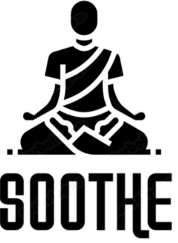

# SHOOTE 

## Meditação Guiada

<video width="640" height="360" controls>
  <source src="videos/meditação_giuada.mp4" type="video/mp4">
  Seu navegador não suporta o elemento de vídeo.
</video>

https://github.com/user-attachments/assets/6bed7d64-e213-4684-8fed-eedab87604c0

## Meditação Fuliness

https://github.com/user-attachments/assets/b0bba192-df08-4076-b9ce-1cbfdf8b00e8

## Meditação Com Mantra

https://github.com/user-attachments/assets/daa948e3-a209-4bbf-a62e-542cd7e316d2

## Cardio 

https://github.com/user-attachments/assets/ddd76bba-4fc8-40bd-aa27-eb99bee8de0d

## Caminhada 

https://github.com/user-attachments/assets/ba558f4b-5c9a-446f-85ed-4e2c46756ee2

## Alongamento 

https://github.com/user-attachments/assets/4d522611-73ee-4ea5-a981-c41fda8db5e6

## Ativar/Desativar Notificação

https://github.com/user-attachments/assets/dd33a9fd-d1c3-4d2a-8b8f-02c567add36a

## Personalizar

https://github.com/user-attachments/assets/66cbfb8f-49d8-4512-9ef0-b0c02b709f17

## Avatar

https://github.com/user-attachments/assets/95a2ca24-93b3-499e-aa41-3d3630b2be38

## Suporte Técnico 

https://github.com/user-attachments/assets/0a72b11b-9f20-456a-b08f-d0578a85c9f4

# SHOOTE Pisicólogo 

https://github.com/user-attachments/assets/2eb99bc2-a0dd-421a-a028-4ba351801a7b

# SHOOTE Suporte 

https://github.com/user-attachments/assets/3a692b73-8869-48e7-b59d-6b53410ebef4

